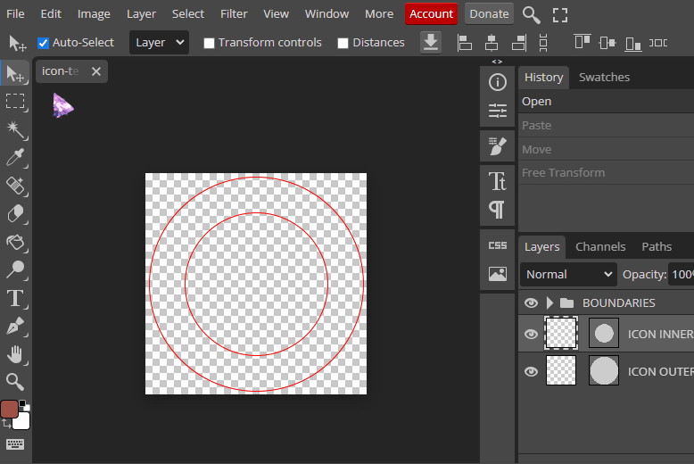
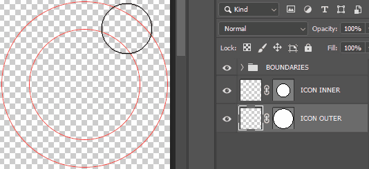
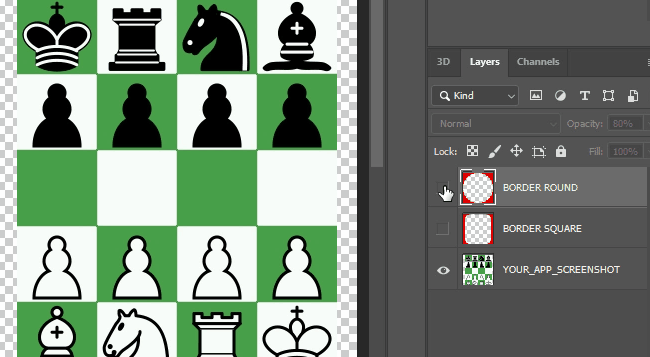

# ZeppOS Resources: Multi-purpose Resources for your needs

### ⓘ PSD Icon Template (248x248)
#### Callhacks 10.0 Special!

[ [**DOWNLOAD**](https://github.com/silver-zepp/zeppos-resources/blob/master/icon-template/icon-template-248x248.psd) ] Easy to use, hassle-free, infallible icon template compliant with ZeppOS app submission design document.

### ⓘ PSD Screenshot Template (360x360)

[ [**DOWNLOAD**](https://github.com/silver-zepp/zeppos-resources/blob/master/screenshot-template/screenshot-template-360x360.psd) ] Make your screenshots pop using this template with square/round boundary preview. Compliant with ZeppOS app submission design document.

### ⓘ No Photoshop? No problem, use [**Photopea**](https://photopea.com/). 
It's free and runs inside the browser, so you don't have to install it.
